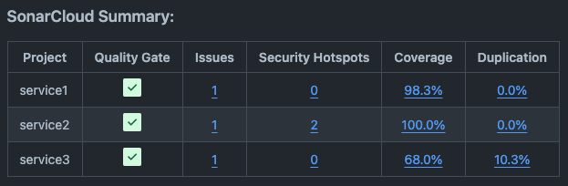

# SonarCloud Summary Action

This action finds SonarCloud pull-request comments, formats them into a table and comments that table within the pull-request.

This is useful within projects where there is multiple SonarCloud projects within a same GitHub repository.

Here's a sneak peak:




## Usage

Add this step to your workflow(s) (it should happen after all your SonarCloud analysis).

```
- name: SonarCloud Summary Action
  uses: thecanadianroot/sonarcloud-summary-action@v1
  with:
    github-repository: ${{ github.repository }}
    github-token: ${{ secrets.GITHUB_TOKEN }}
    pull-request: ${{ github.event.pull_request.number }} 
```

### Inputs

| Input                  | Description                                                                                                                                                                                                                                                                           | Required | Default value                           |
|------------------------|---------------------------------------------------------------------------------------------------------------------------------------------------------------------------------------------------------------------------------------------------------------------------------------|:--------:|-----------------------------------------|
| `github-repository`    | Your GitHub repository (eg. `your_organization/your_repository`)                                                                                                                                                                                                                      |   yes    | N/A                                     |
| `github-token`         | Your GitHub token                                                                                                                                                                                                                                                                     |   yes    | N/A                                     |
| `pull-request`         | Your pull-request number (eg. `12345`)                                                                                                                                                                                                                                                |   yes    | N/A                                     |
| `project-name-pattern` | The pattern to use in order to find a project name within a SonarCloud pull-request comment. Set this if you need a special way to extract your project name within a SonarCloud pull-request comment (you must have a named group called `project_name` within your pattern though). |    no    | `id=(?P<project_name>[a-zA-Z-_\.\:]+)&` |
| `commit`               | The commit from which you want to create a SonarCloud summary (this helps reducing requests to GitHub API by only considering SonarCloud comments that are past a certain commit).                                                                                                    |    no    | N/A                                     |


## Contribute

Feel free to open up issues, open pull-requests or suggest features! 

Here's a short list of what's coming up / needs work:

- Document other optional inputs
- Tests
